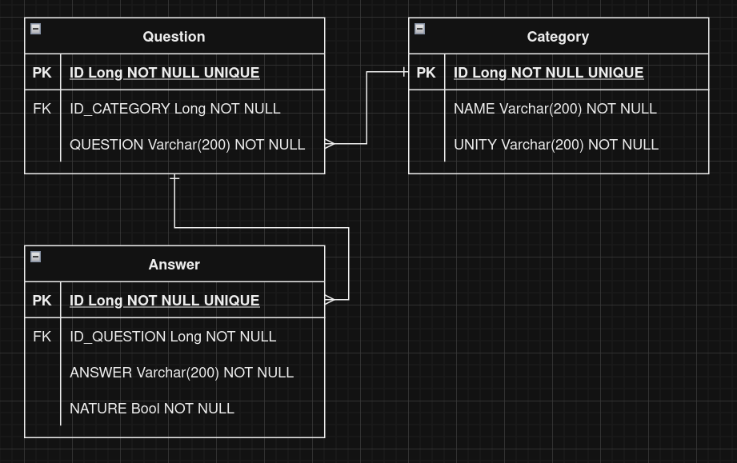

# Info
- This is a project aimed to help study german
- We intend to start by making the back end and then we make a quick UI

# Tools
- As db we will be using postgresql
- Front end will be in react
- Back end will be go graphql